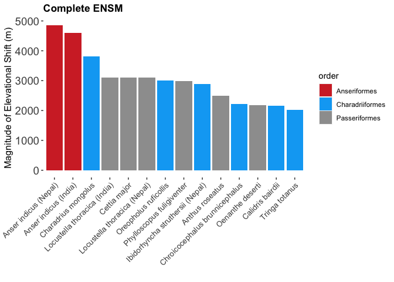
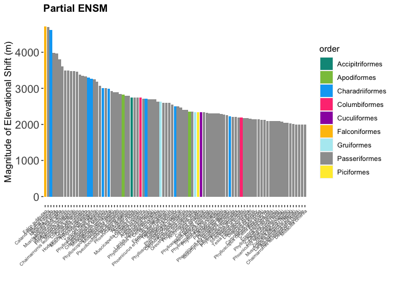
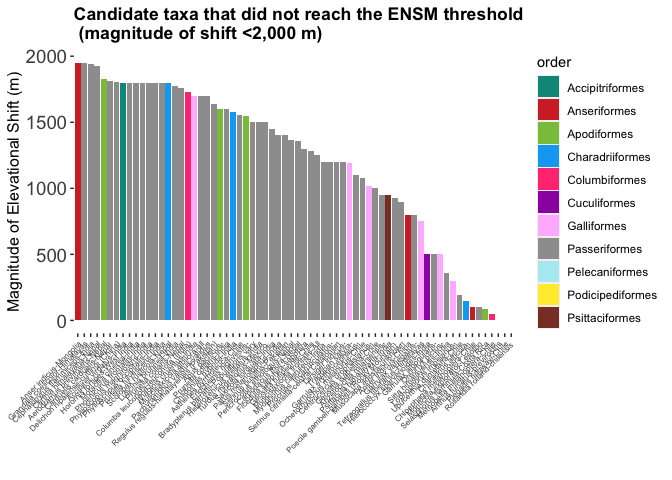
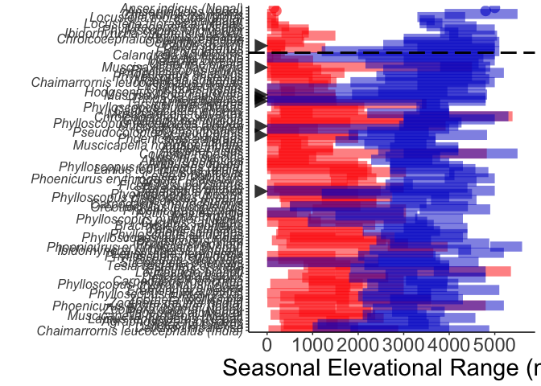
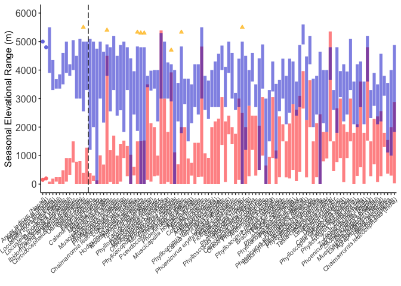

# Script associated with data wrangling, plots, and figures for Williamson & Witt, ‘Elevational niche-shift migration’. This script inclues:

*Data wrangling used for basic ENSM calculations *Using data from Table
S1 (complete database of ENSM taxa) to generate magnitude of shift bar
plots (Figs S4-S5) *Using data from Table S2 (list of taxa that failed
to qualify as ENSM) to generate magnitude of shift bar plots (Figure S7)
*Code used to make Figure 4, seasonal elevational range and magnitudes
of shift for all complete and partial ENSM taxa. Some quick calculations
to generate magnitude of elevation shift barplots for the ensmlement
(Figs S4-S5) of

-----

``` r
rm(list=ls(all=TRUE)) # clear workspace 
setwd("/Users/Jessie/Dropbox (MSBbirds)/Rdirectory/ENSM")
```

# Load packages

``` r
library(rgbif)
library(dplyr)
```

    ## 
    ## Attaching package: 'dplyr'

    ## The following objects are masked from 'package:stats':
    ## 
    ##     filter, lag

    ## The following objects are masked from 'package:base':
    ## 
    ##     intersect, setdiff, setequal, union

``` r
library(plyr)
```

    ## ------------------------------------------------------------------------------

    ## You have loaded plyr after dplyr - this is likely to cause problems.
    ## If you need functions from both plyr and dplyr, please load plyr first, then dplyr:
    ## library(plyr); library(dplyr)

    ## ------------------------------------------------------------------------------

    ## 
    ## Attaching package: 'plyr'

    ## The following objects are masked from 'package:dplyr':
    ## 
    ##     arrange, count, desc, failwith, id, mutate, rename, summarise,
    ##     summarize

``` r
library(XML)
library(httr)
library(maps)
```

    ## 
    ## Attaching package: 'maps'

    ## The following object is masked from 'package:plyr':
    ## 
    ##     ozone

``` r
library(ggplot2)
library(elevatr)
library(DescTools)
library(maptools)
```

    ## Loading required package: sp

    ## Checking rgeos availability: TRUE

``` r
library(gridExtra)
```

    ## 
    ## Attaching package: 'gridExtra'

    ## The following object is masked from 'package:dplyr':
    ## 
    ##     combine

``` r
library(dplyr)
library(viridis)
```

    ## Loading required package: viridisLite

``` r
library(RColorBrewer)
library(cowplot)
library(forcats) # for releveling factors 
library(grDevices)
```

# Read in data

``` r
ensm <- read.csv("/Users/Jessie/Dropbox (MSBbirds)/Rdirectory/ENSM/0_data_files/TableS1_ENSM_Supplement_Nov2020.csv", header= TRUE)
#ensm <- na.omit(ensm) # no NAs in the data but weird lingering blank rows from reading in the csv; get rid of these
ne <- read.csv("/Users/Jessie/Dropbox (MSBbirds)/Rdirectory/ENSM/0_data_files/TableS2_NonENSM_Supplement_Nov2020.csv", header= TRUE) # ne = non-ENSM
```

# Clean and filter ENSM taxa data (Table S1)

``` r
# Drop columns you don't want 
ensm <- subset(ensm, select = -c(order_of_orders,
                                 order_of_families,
                                 lower_limit_is,
                                 upper_limit_is,
                                 references,
                                 gbif_doi
                                  ))

# Need to assign unique names to species that have multiple ENSM populations so plots below show all taxa 
# An easier way of doing this is as I did it below w/ paste0(), but I want to retain this formatting, so keeping it.
ensm$unique_name <- paste(ensm$sciname) # Create new unique name column that you'll customize 
ensm[ensm$sciname=="Phoenicurus erythrogaster" & ensm$ensm_pop=="Pakistan",][23] <- "Phoenicurus erythrogaster (Pakistan)"
ensm[ensm$sciname=="Phoenicurus erythrogaster" & ensm$ensm_pop=="Nepal",][23] <- "Phoenicurus erythrogaster (Nepal)"
ensm[ensm$sciname=="Phoenicurus erythrogaster" & ensm$ensm_pop=="India",][23] <- "Phoenicurus erythrogaster (India)"
ensm[ensm$sciname=="Anser indicus" & ensm$ensm_pop=="India",][23] <- "Anser indicus (India)"
ensm[ensm$sciname=="Anser indicus" & ensm$ensm_pop=="Nepal",][23] <- "Anser indicus (Nepal)" 
ensm[ensm$sciname=="Chaimarrornis leucocephalus" & ensm$ensm_pop=="India",][23] <- "Chaimarrornis leucocephalus (India)"
ensm[ensm$sciname=="Chaimarrornis leucocephalus" & ensm$ensm_pop=="Nepal",][23] <- "Chaimarrornis leucocephalus (Nepal)" 
ensm[ensm$sciname=="Ibidorhyncha struthersii" & ensm$ensm_pop=="Bhutan",][23] <- "Ibidorhyncha struthersii (Bhutan)"
ensm[ensm$sciname=="Ibidorhyncha struthersii" & ensm$ensm_pop=="Nepal",][23] <- "Ibidorhyncha struthersii (Nepal)"
ensm[ensm$sciname=="Lanius tephronotus" & ensm$ensm_pop=="India",][23] <- "Lanius tephronotus (India)"
ensm[ensm$sciname=="Lanius tephronotus" & ensm$ensm_pop=="Nepal",][23] <- "Lanius tephronotus (Nepal)"
ensm[ensm$sciname=="Locustella thoracica" & ensm$ensm_pop=="India",][23] <- "Locustella thoracica (India)"
ensm[ensm$sciname=="Locustella thoracica" & ensm$ensm_pop=="Nepal",][23] <- "Locustella thoracica (Nepal)"
ensm[ensm$sciname=="Muscicapella hodgsoni" & ensm$ensm_pop=="India",][23] <- "Muscicapella hodgsoni (India)"
ensm[ensm$sciname=="Muscicapella hodgsoni" & ensm$ensm_pop=="Nepal",][23] <- "Muscicapella hodgsoni (Nepal)"
ensm[ensm$sciname=="Phylloscopus chloronotus" & ensm$ensm_pop=="India",][23] <- "Phylloscopus chloronotus (India)"
ensm[ensm$sciname=="Phylloscopus chloronotus" & ensm$ensm_pop=="Nepal",][23] <- "Phylloscopus chloronotus (Nepal)"
ensm[ensm$sciname=="Phylloscopus humei" & ensm$ensm_pop=="India",][23] <- "Phylloscopus humei (India)"
ensm[ensm$sciname=="Phylloscopus humei" & ensm$ensm_pop=="Nepal",][23] <- "Phylloscopus humei (Nepal)"
ensm[ensm$sciname=="Phylloscopus pulcher" & ensm$ensm_pop=="India",][23] <- "Phylloscopus pulcher (India)"
ensm[ensm$sciname=="Phylloscopus pulcher" & ensm$ensm_pop=="Nepal",][23] <- "Phylloscopus pulcher (Nepal)"
ensm[ensm$sciname=="Phylloscopus trochiloides" & ensm$ensm_pop=="India",][23] <- "Phylloscopus trochiloides (India)"
ensm[ensm$sciname=="Phylloscopus trochiloides" & ensm$ensm_pop=="Nepal",][23] <- "Phylloscopus trochiloides (Nepal)"
ensm[ensm$sciname=="Zoothera dauma" & ensm$ensm_pop=="India",][23] <- "Zoothera dauma (India)"
ensm[ensm$sciname=="Zoothera dauma" & ensm$ensm_pop=="Nepal",][23] <- "Zoothera dauma (Nepal)"
```

# Clean, filter, wrangle non-ENSM taxa data (Table S2; added for reference at request of AE)

``` r
# Combine genus and species columns into a 'sciname' column 
ne$sciname <- paste0(ne$genus, " ", ne$species) # Combine genus and species cols into one 

# Now create unique_name by combining sciname with ensm_pop (necessary to plot all discrete taxa)
# Note: some are long and clunky because this file is a relict file, added at AE request to supplement 
ne$unique_name <- paste0(ne$sciname, "-", ne$ensm_pop) # Combine genus and species cols into one
```

# Calculations of ENSM ranges and magnitudes of elevational shift

Note: These were originally done in Excel for the published manuscript,
but because tabulations in Excel are bad practice and make it hard to
reproduce analyses, I’ve re-calculated them here.

``` r
# Magnitude of shift for complete ENSM taxa 
ensm$complete.mag <- ensm$LLH-ensm$ULL 

# If complete magnitude of shift is <2,000 m, insert NA 
for (i in 1:nrow(ensm)){
 if(ensm$complete.mag[i] < 2000){
 ensm$complete.mag[i] <- NA
 }
}

# Calculate upper and lower shifts 
ensm$upper.shift <- ensm$ULH-ensm$ULL
ensm$lower.shift <- ensm$LLH-ensm$LLL

# Magnitude of shift for partial ENSM taxa
# ensm$partial.mag <- NA # instantiate 

library(dplyr)
ensm <- ensm %>% mutate(partial.mag=pmax(upper.shift,lower.shift))  

# Fill NAs for all 'partial magnitudes' for all complete ENSM taxa (for clarity, really)
# A loop or dplyr line would be a much better way to do this, but I couldn't quite get syntax so going for quick n dirty. 
ensm[ensm$completeYN=="yes" & ensm$sciname=="Anser indicus",][, "partial.mag"] <- NA 
ensm[ensm$completeYN=="yes" & ensm$sciname=="Cettia major",][, "partial.mag"] <- NA
ensm[ensm$completeYN=="yes" & ensm$sciname=="Ibidorhyncha struthersii",][, "partial.mag"] <- NA
ensm[ensm$completeYN=="yes" & ensm$sciname=="Anthus roseatus",][, "partial.mag"] <- NA
ensm[ensm$completeYN=="yes" & ensm$sciname=="Locustella thoracica",][, "partial.mag"] <- NA
ensm[ensm$completeYN=="yes" & ensm$sciname=="Chroicocephalus brunnicephalus",][, "partial.mag"] <- NA
ensm[ensm$completeYN=="yes" & ensm$sciname=="Tringa totanus",][, "partial.mag"] <- NA
ensm[ensm$completeYN=="yes" & ensm$sciname=="Phylloscopus fuligiventer",][, "partial.mag"] <- NA
ensm[ensm$completeYN=="yes" & ensm$sciname=="Oreopholus ruficollis",][, "partial.mag"] <- NA
ensm[ensm$completeYN=="yes" & ensm$sciname=="Oenanthe deserti",][, "partial.mag"] <- NA
ensm[ensm$completeYN=="yes" & ensm$sciname=="Calidris bairdii",][, "partial.mag"] <- NA
ensm[ensm$completeYN=="yes" & ensm$sciname=="Charadrius mongolus",][, "partial.mag"] <- NA

# Make a combined magnitude of shift column for both complete and partial (mostly for plots below)
ensm <- ensm %>% mutate(combined.mag = coalesce(complete.mag, partial.mag)) 

# Now write over completeYN and partialYN
# If complete, can partial also be true? Figure this out.

# Drop relict excel column calculations in favor of R-generated ones
ensm <- subset(ensm, select = -c(complete_ensm_magnitude,
                                 upper_shift, 
                                 lower_shift,  
                                 partial_ensm_magnitude
                                  ))
```

# subset by complete and partial ENSM

``` r
complete <- ensm[which(ensm$completeYN == "yes"), ] # complete ENSM only; 14 taxa 
partial <- ensm[which(ensm$partialYN == "yes"), ] # partial ENSM only; 91 taxa 
```

# Counts of ENSM taxa and species

Summary statistics for the paper

``` r
# IF this returns something incorrect, make sure to boot from dplyr! 'summarise' pulls from something else if not
# By boot, I mean 'dplyr::summarise'

# Summarize by ENSM species   
ensm.species.summary <- ensm %>% group_by(sciname) %>% dplyr::summarise(pop_count=length(sciname)); ensm.species.summary
```

    ## `summarise()` ungrouping output (override with `.groups` argument)

    ## # A tibble: 92 x 2
    ##    sciname                  pop_count
    ##    <chr>                        <int>
    ##  1 Accipiter nisus                  1
    ##  2 Actitis hypoleucos               1
    ##  3 Agraphospiza rubescens           1
    ##  4 Anser indicus                    2
    ##  5 Anthropoides virgo               1
    ##  6 Anthus hodgsoni                  1
    ##  7 Anthus roseatus                  1
    ##  8 Anthus trivialis                 1
    ##  9 Brachypteryx montana             1
    ## 10 Calandrella acutirostris         1
    ## # … with 82 more rows

``` r
# A list of 92 total ENSM species 
# The second column "pop_count" lists the total # of identified ENSM populations 
sum(duplicated(ensm.species.summary[, c("sciname")])) # Verify no duplicate records under binomial name 
```

    ## [1] 0

``` r
# Summarize by ENSM species by order  
ensm.speciesbyorder.summary <- ensm %>% group_by(order) %>% dplyr::summarise(pop_count=length(sciname)); ensm.speciesbyorder.summary # All 10 orders represented 
```

    ## `summarise()` ungrouping output (override with `.groups` argument)

    ## # A tibble: 10 x 2
    ##    order           pop_count
    ##    <chr>               <int>
    ##  1 Accipitriformes         1
    ##  2 Anseriformes            2
    ##  3 Apodiformes             2
    ##  4 Charadriiformes        14
    ##  5 Columbiformes           2
    ##  6 Cuculiformes            1
    ##  7 Falconiformes           1
    ##  8 Gruiformes              2
    ##  9 Passeriformes          79
    ## 10 Piciformes              1

``` r
# The second column "pop_count" lists the total # of identified ENSM populations per order

# Now summarize ENSM species x order 
# ensm.speciesbyorder.summary2 <- ensm.speciesbyorder.summary %>% group_by(sciname, order) %>% dplyr::summarise(total=length(pop_count)); ensm.speciesbyorder.summary2
# # # This gives total number of SPECIES per order 
# # sum(ensm.speciesbyorder.summary2$total) 
 
# Summarize by ENSM species by family  
ensm.speciesbyfam.summary <- ensm %>% group_by(sciname, family) %>% dplyr::summarise(pop_count=length(sciname)); ensm.speciesbyfam.summary
```

    ## `summarise()` regrouping output by 'sciname' (override with `.groups` argument)

    ## # A tibble: 92 x 3
    ## # Groups:   sciname [92]
    ##    sciname                  family       pop_count
    ##    <chr>                    <chr>            <int>
    ##  1 Accipiter nisus          Accipitridae         1
    ##  2 Actitis hypoleucos       Scolopacidae         1
    ##  3 Agraphospiza rubescens   Fringillidae         1
    ##  4 Anser indicus            Anatidae             2
    ##  5 Anthropoides virgo       Gruidae              1
    ##  6 Anthus hodgsoni          Motacillidae         1
    ##  7 Anthus roseatus          Motacillidae         1
    ##  8 Anthus trivialis         Motacillidae         1
    ##  9 Brachypteryx montana     Muscicapidae         1
    ## 10 Calandrella acutirostris Alaudidae            1
    ## # … with 82 more rows

``` r
# The second column "pop_count" lists the total # of identified ENSM populations

# Now sum families 
ensm.speciesbyfam.summary2 <- ensm.speciesbyfam.summary %>% group_by(family) %>% dplyr::summarise(total=length(pop_count)); ensm.speciesbyfam.summary2
```

    ## `summarise()` ungrouping output (override with `.groups` argument)

    ## # A tibble: 29 x 2
    ##    family       total
    ##    <chr>        <int>
    ##  1 Accipitridae     1
    ##  2 Alaudidae        2
    ##  3 Anatidae         1
    ##  4 Cettiidae        4
    ##  5 Charadriidae     2
    ##  6 Columbidae       2
    ##  7 Cuculidae        1
    ##  8 Emberizidae      1
    ##  9 Falconidae       1
    ## 10 Fringillidae     7
    ## # … with 19 more rows

``` r
# This gives total number of SPECIES per order 
sum(ensm.speciesbyfam.summary2$total) # All 92 species of 29 families accounted for
```

    ## [1] 92

``` r
# # ENSM taxon count (this should just be 105)
#ENSM.taxon.count <- ensm %>% group_by(common_name) %>% summarise(count=length(common_name)); ENSM.taxon.count

# breed high 
breed.direction <- ensm %>% group_by(breeding_dir) %>% dplyr::summarise(count=length(breeding_dir)); breed.direction
```

    ## `summarise()` ungrouping output (override with `.groups` argument)

    ## # A tibble: 2 x 2
    ##   breeding_dir count
    ##   <chr>        <int>
    ## 1 High            97
    ## 2 Low              8

``` r
# 97 breed high, 8 breed low 

# latitudinal migrants
lat.migrants <- ensm %>% group_by(lat_migrant) %>% dplyr::summarise(count=length(lat_migrant)); lat.migrants
```

    ## `summarise()` ungrouping output (override with `.groups` argument)

    ## # A tibble: 2 x 2
    ##   lat_migrant count
    ##         <int> <int>
    ## 1           0    29
    ## 2           1    76

``` r
# 76 latitudinal migrants
# 29 taxa that do not also migrate latitudinally 

# partial latitudinal migrants
partial.lat.migrants <- ensm %>% group_by(partial_lat_migrant) %>% dplyr::summarise(count=length(partial_lat_migrant)); partial.lat.migrants
```

    ## `summarise()` ungrouping output (override with `.groups` argument)

    ## # A tibble: 2 x 2
    ##   partial_lat_migrant count
    ##                 <int> <int>
    ## 1                   0    83
    ## 2                   1    22

``` r
# 22 partial latitudinal migrants
# 83 taxa not partial latitudinal migrants 

# partial elevational migrants
partial.elev.migrants <- ensm %>% group_by(partial_elev_migrant) %>% dplyr::summarise(count=length(partial_elev_migrant)); partial.elev.migrants
```

    ## `summarise()` ungrouping output (override with `.groups` argument)

    ## # A tibble: 2 x 2
    ##   partial_elev_migrant count
    ##                  <int> <int>
    ## 1                    0    91
    ## 2                    1    14

``` r
# 14 partial elevational migrants
# 91 taxa not partial elevational migrants 

# partial elevational AND partial latitudinal migrants
partial.elevlat.migrants <- ensm %>% group_by(partial_elev_migrant, partial_lat_migrant) %>% dplyr::summarise(count=length(partial_elev_migrant)); partial.elevlat.migrants
```

    ## `summarise()` regrouping output by 'partial_elev_migrant' (override with `.groups` argument)

    ## # A tibble: 4 x 3
    ## # Groups:   partial_elev_migrant [2]
    ##   partial_elev_migrant partial_lat_migrant count
    ##                  <int>               <int> <int>
    ## 1                    0                   0    73
    ## 2                    0                   1    18
    ## 3                    1                   0    10
    ## 4                    1                   1     4

``` r
# 73 taxa are neither partial elevational or partial latitudinal migrants 
# 18 taxa are partial latitudinal migrants but NOT partial elevational migrants
# 10 taxa are partial elevational migrants but NOT partial latitudinal migrants
# 4 taxa are both partial elevational migrants AND partial latitudinal migrants 

# complete ENSM latitudinal migration summary 
complete.lat.sum <- ensm %>% group_by(completeYN, lat_migrant) %>% dplyr::summarise(count=length(lat_migrant)); complete.lat.sum
```

    ## `summarise()` regrouping output by 'completeYN' (override with `.groups` argument)

    ## # A tibble: 3 x 3
    ## # Groups:   completeYN [2]
    ##   completeYN lat_migrant count
    ##   <chr>            <int> <int>
    ## 1 no                   0    29
    ## 2 no                   1    62
    ## 3 yes                  1    14

``` r
# What this is saying: 
# of the 14 complete ENSM taxa, all are also latitudinal migrants (so 14 complete ENSM, 14 lat)
# of non-complete ENSM: 62 are also latitudinal migrants
# of non-complete ENSM: 29 do not migrate latitudinally 

# Another way to confirm complete.lat.sum: partial ENSM lat migration summary 
partial.lat.sum <- ensm %>% group_by(partialYN, lat_migrant) %>% dplyr::summarise(count=length(lat_migrant)); partial.lat.sum
```

    ## `summarise()` regrouping output by 'partialYN' (override with `.groups` argument)

    ## # A tibble: 3 x 3
    ## # Groups:   partialYN [2]
    ##   partialYN lat_migrant count
    ##   <chr>           <int> <int>
    ## 1 no                  1    14
    ## 2 yes                 0    29
    ## 3 yes                 1    62

``` r
# partial ensm and partial latitudinal migration comparison
partialensm.partiallat <- partial %>% group_by(partial_lat_migrant) %>% dplyr::summarise(count=length(partial_lat_migrant)); partialensm.partiallat
```

    ## `summarise()` ungrouping output (override with `.groups` argument)

    ## # A tibble: 2 x 2
    ##   partial_lat_migrant count
    ##                 <int> <int>
    ## 1                   0    71
    ## 2                   1    20

``` r
# 20 partial ENSM are also partial latitudinal migrants
# 71 partial ENSM are not partial latitudinal migrants 

# complete ensm and partial latitudinal migration comparison
completeensm.partiallat <- complete %>% group_by(partial_lat_migrant) %>% dplyr::summarise(count=length(partial_lat_migrant)); completeensm.partiallat
```

    ## `summarise()` ungrouping output (override with `.groups` argument)

    ## # A tibble: 2 x 2
    ##   partial_lat_migrant count
    ##                 <int> <int>
    ## 1                   0    12
    ## 2                   1     2

``` r
# 2 complete ENSM are also partial latitudinal migrants
# 12 complete ENSM are NOT partial latitudinal migrants

# Region summary
region.summary <- ensm %>% group_by(region) %>% dplyr::summarise(count=length(region)); region.summary
```

    ## `summarise()` ungrouping output (override with `.groups` argument)

    ## # A tibble: 3 x 2
    ##   region               count
    ##   <chr>                <int>
    ## 1 Asia                    90
    ## 2 Nearctic-Neotropical     4
    ## 3 South America           11

``` r
# 90 Asia
# 4 Nearctic-Neotropical
# 11 South America 

# Family summary
family.summary <- ensm %>% group_by(family) %>% dplyr::summarise(count=length(family)); family.summary
```

    ## `summarise()` ungrouping output (override with `.groups` argument)

    ## # A tibble: 29 x 2
    ##    family       count
    ##    <chr>        <int>
    ##  1 Accipitridae     1
    ##  2 Alaudidae        2
    ##  3 Anatidae         2
    ##  4 Cettiidae        4
    ##  5 Charadriidae     2
    ##  6 Columbidae       2
    ##  7 Cuculidae        1
    ##  8 Emberizidae      1
    ##  9 Falconidae       1
    ## 10 Fringillidae     7
    ## # … with 19 more rows

``` r
family.summary <- family.summary[with(family.summary, order(-count)), ]; family.summary # Sort in descending order
```

    ## # A tibble: 29 x 2
    ##    family         count
    ##    <chr>          <int>
    ##  1 Muscicapidae      25
    ##  2 Phylloscopidae    14
    ##  3 Fringillidae       7
    ##  4 Scolopacidae       7
    ##  5 Motacillidae       5
    ##  6 Tyrannidae         5
    ##  7 Cettiidae          4
    ##  8 Hirundinidae       3
    ##  9 Laridae            3
    ## 10 Turdidae           3
    ## # … with 19 more rows

``` r
# 29 families with counts of # taxa per family 
# Top families: Muscicapidae (n=25), Phylloscopidae (n=14), Fringillidae (n=7), Scolopacidae (n=7)

# Order summary
order.summary <- ensm %>% group_by(order) %>% dplyr::summarise(count=length(order)); order.summary
```

    ## `summarise()` ungrouping output (override with `.groups` argument)

    ## # A tibble: 10 x 2
    ##    order           count
    ##    <chr>           <int>
    ##  1 Accipitriformes     1
    ##  2 Anseriformes        2
    ##  3 Apodiformes         2
    ##  4 Charadriiformes    14
    ##  5 Columbiformes       2
    ##  6 Cuculiformes        1
    ##  7 Falconiformes       1
    ##  8 Gruiformes          2
    ##  9 Passeriformes      79
    ## 10 Piciformes          1

``` r
order.summary <- order.summary[with(order.summary, order(-count)), ]; order.summary # Sort in descending order
```

    ## # A tibble: 10 x 2
    ##    order           count
    ##    <chr>           <int>
    ##  1 Passeriformes      79
    ##  2 Charadriiformes    14
    ##  3 Anseriformes        2
    ##  4 Apodiformes         2
    ##  5 Columbiformes       2
    ##  6 Gruiformes          2
    ##  7 Accipitriformes     1
    ##  8 Cuculiformes        1
    ##  9 Falconiformes       1
    ## 10 Piciformes          1

``` r
# 10 orders with counts of # taxa per family 
# Top orders: Passeriformres (n=79), Charadriiformes (n=14)

# Mountain range summary 
mtn.range.summary <- ensm %>% group_by(mtn_range) %>% dplyr::summarise(count=length(mtn_range)); mtn.range.summary
```

    ## `summarise()` ungrouping output (override with `.groups` argument)

    ## # A tibble: 3 x 2
    ##   mtn_range       count
    ##   <chr>           <int>
    ## 1 Andes              15
    ## 2 Himalayas          87
    ## 3 Tibetan Plateau     3

``` r
# 15 Andes 
# 87 Himalayas
# 3 Tibetan Plateau 

# Region summary
region.breeding.summary <- ensm %>% group_by(region, breeding_dir) %>% 
                           dplyr::summarise(count=length(region)); region.breeding.summary
```

    ## `summarise()` regrouping output by 'region' (override with `.groups` argument)

    ## # A tibble: 4 x 3
    ## # Groups:   region [3]
    ##   region               breeding_dir count
    ##   <chr>                <chr>        <int>
    ## 1 Asia                 High            90
    ## 2 Nearctic-Neotropical Low              4
    ## 3 South America        High             7
    ## 4 South America        Low              4

``` r
# 90 taxa breed high in the Himalayas
# 4 taxa breed low Nearctic-Neotropical 
# 4 taxa breed low in South America, 7 breed high 
# This means only 8 total taxa breed low of 105

# Mountain range + breeding summary 
mtn.range.breeding.summary <- ensm %>% group_by(mtn_range, breeding_dir) %>% 
                                   dplyr::summarise(count=length(mtn_range)); mtn.range.breeding.summary
```

    ## `summarise()` regrouping output by 'mtn_range' (override with `.groups` argument)

    ## # A tibble: 4 x 3
    ## # Groups:   mtn_range [3]
    ##   mtn_range       breeding_dir count
    ##   <chr>           <chr>        <int>
    ## 1 Andes           High             7
    ## 2 Andes           Low              8
    ## 3 Himalayas       High            87
    ## 4 Tibetan Plateau High             3

``` r
# Nice table of breeding direction (high or low and mountain range)

# Breeding dir summary
breeding.dir.summary <- ensm %>% group_by(breeding_dir) %>% 
                           dplyr::summarise(count=length(region)); breeding.dir.summary
```

    ## `summarise()` ungrouping output (override with `.groups` argument)

    ## # A tibble: 2 x 2
    ##   breeding_dir count
    ##   <chr>        <int>
    ## 1 High            97
    ## 2 Low              8

``` r
# 97 taxa breed high 
# 8 taxa breed low
```

For testing of sorting: test \<- ensm %\>% group\_by(sciname, ensm\_pop)
%\>% dplyr::summarise(pop\_count=length(sciname)); ensm.species.summary

# Color palettes

``` r
# a 3-color palette for complete ENSM taxa 
complete_colors <- c( "#D32F2F", # Anseriformes
                      "#03A9F4", # Charadriiformes
                      "#9E9E9E" # Passeriformes
                            )

# a 9-color palette for partial ENSM taxa 
partial_colors <- c( "#009688", # Accipitriformes
                      "#8BC34A", # Apodiformes
                      "#03A9F4", # Charadriiformes
                      "#FF4081", # Columbiformes
                       "#9C27B0", # Cuculiformes
                      "#FFC107", # Falconiformes
                      "#B2EBF2", # Gruiformes
                      "#9E9E9E", # Passeriformes  #8C847B
                      "#FFEB3B" # Piciformes
                            )

# a 11-color palette for non-ENSM taxa 
ne_colors <- c(  "#009688", # Accipitriformes
                      "#D32F2F", # Anseriformes
                      "#8BC34A", # Apodiformes
                      "#03A9F4", # Charadriiformes
                      "#FF4081", # Columbiformes
                      "#9C27B0", # Cuculiformes
                      "plum1",   # Galliformes
                      "#9E9E9E", # Passeriformes  #8C847B
                      "#B2EBF2", # Pelecaniformes 
                      "#FFEB3B", # Podicipediformes
                      "coral4"   # "Psittaciformes"
                            )
```

# Figure S4: Summary of elevational magnitudes - complete ENSM

``` r
#sort by complete ENSM magnitude (descending)
#complete <- complete[with(complete, order(-complete.mag)), ] # Don't think I need this if calling reorder() in plot

# Magnitude of shift of complete ENSM taxa
p1<- ggplot(data=complete, aes(x=reorder(unique_name, -complete.mag), y=complete.mag, fill=order)) +
# x=reorder is saying "reorder common_name on x-axis by magnitude of elev shift in DESCENDING"
     geom_bar(stat="identity", position=position_dodge()) +
#     scale_fill_viridis(option="D", discrete=TRUE) + # Option=A specifies "magma", B=inferno, C=Plasma, D=viridis
    # scale_fill_manual(values=c(Anseriformes="#6E1EDC", Charadriiformes="#1CD2D8", Passeriformes="#8C847B")) +
     scale_fill_manual(values=complete_colors) +
     theme(axis.text.x=element_text(angle=45, hjust=1),
           panel.grid.major=element_blank(), 
           panel.grid.minor=element_blank(),
           panel.background = element_blank()) +
     labs(title="Complete ENSM",x="", y = "Magnitude of Elevational Shift (m)") +
     theme(plot.title = element_text(face="bold")) + # This makes panel header bold 
       # This is good for labeling figure panels! Avoids having to manually toy w/ hjust and vjust
      theme(axis.text.y=element_text(size=14), axis.text.x=element_text(size=10), axis.title=element_text(size=12))
print(p1)
```

<!-- -->

``` r
ggsave(p1, filename="FigS4_CompleteENSM_RankedMagnitude_ElevShift.pdf", height=7, width=9, units="in")
```

# Figure S5: Summary of elevational magnitudes - partial ENSM

``` r
#sort by complete ENSM magnitude (descending)
#partial <- partial[with(partial, order(-partial.mag)), ] # Don't think I need this if calling reorder() in plot

# Magnitude of shift of partial ENSM taxa
p2 <- ggplot(data=partial, aes(x=reorder(unique_name, -partial.mag), y=partial.mag, fill=order)) +
# x=reorder is saying "reorder common_name on x-axis by magnitude of elev shift in DESCENDING"
    #  scale_fill_viridis(option="C", discrete=TRUE) + # Option=A specifies "magma", B=inferno, C=Plasma, D=viridis
      scale_fill_manual(values=partial_colors) +
      geom_bar(stat="identity", position=position_dodge()) +
      theme(axis.text.x=element_text(angle=45, hjust=1),
            panel.grid.major=element_blank(), 
            panel.grid.minor=element_blank(),
            panel.background = element_blank()) +
      labs(title="Partial ENSM",x="", y = "Magnitude of Elevational Shift (m)") +
      theme(plot.title = element_text(face="bold")) + # This makes panel header bold 
       # This is good for labeling figure panels! Avoids having to manually toy w/ hjust and vjust
      theme(axis.text.y=element_text(size=14), axis.text.x=element_text(size=6), axis.title=element_text(size=12))
print(p2)
```

<!-- -->

``` r
ggsave(p2, filename="FigS5_PartialENSM_RankedMagnitude_ElevShift.pdf", height=7, width=9, units="in")

# Note: common_names NEED to have region-specific designation as underscores (e.g. "India", "Nepal", etc.)
# If they don't, ggplot will think multiple populations should be plotted on top of each other, which puts bars out of order

# grid.arrange(p1, p2) # plot complete and partial together, kinda looks crowded
```

I answered this above, but here’s a base R workaround: Why is this
weirdly plotting without ranking by magnitudes of shift ??? Chauncey’s
fix for this:
barplot(partial\[order(partial\[,18\],decreasing=TRUE),\]\[,18\],names.arg=partial\[order(partial\[,18\],decreasing=TRUE),\]\[,7\])

# Figure S7: Summary of elevational magnitudes for non-ENSM taxa

This list of taxa that failed to qualify as ENSM (magnitude of shift
\<2,000 m) was requested during review in Nov 2020.

``` r
#sort by complete ENSM magnitude (descending)
#partial <- partial[with(partial, order(-partial.mag)), ] # Don't think I need this if calling reorder() in plot

# Magnitude of shift of partial ENSM taxa 
p3 <- ggplot(data=ne, aes(x=reorder(unique_name, -partial_ensm_magnitude), y=partial_ensm_magnitude, fill=order)) +
        # x=reorder is saying "reorder common_name on x-axis by magnitude of elev shift in DESCENDING"
        #  scale_fill_viridis(option="C", discrete=TRUE) + # Option=A specifies "magma", B=inferno, C=Plasma, D=viridis
      scale_fill_manual(values=ne_colors) +
      geom_bar(stat="identity", position=position_dodge()) +
      theme(axis.text.x=element_text(angle=45, hjust=1),
            panel.grid.major=element_blank(), 
            panel.grid.minor=element_blank(),
            panel.background = element_blank()) +
      labs(title="Taxa that failed to qualify as ENSM (magnitude of shift <2,000 m)",x="", 
           y = "Magnitude of Elevational Shift (m)") +
      theme(plot.title = element_text(face="bold")) + # This makes panel header bold 
       # This is good for labeling figure panels! Avoids having to manually toy w/ hjust and vjust
      theme(axis.text.y=element_text(size=14), axis.text.x=element_text(size=6), axis.title=element_text(size=12))
print(p3)
```

<!-- -->

``` r
ggsave(p3, filename="FigS7_non-ENSM_RankedMagnitude_ElevShift.pdf", height=7, width=9, units="in")

# Note: common_names NEED to have region-specific designation as underscores (e.g. "India", "Nepal", etc.)
# If they don't, ggplot will think multiple populations should be plotted on top of each other, which puts bars out of order
```

# Re-level ‘unique\_name’ of ENSM taxa (for seasonal elevational distribution and shift plots)

``` r
# Add 'plot.order' row ID numbers to be able to sort properly
# Re-leveling factor of unique_name was best way to solve geom_point undoing descending sort from ggplot() 

# Complete ENSM taxa 
complete <- complete[with(complete, order(-complete.mag)), ] # Sort in descending order 
complete$plot.order <- 1:nrow(complete) # Add row ID #s for descending order sort 
complete <- complete %>% mutate(unique_name = fct_reorder(unique_name, plot.order)) # now relevel based on plot.order 
levels(complete$unique_name) # check that releveling worked 
```

    ##  [1] "Anser indicus (Nepal)"            "Anser indicus (India)"           
    ##  [3] "Charadrius mongolus"              "Locustella thoracica (India)"    
    ##  [5] "Cettia major"                     "Locustella thoracica (Nepal)"    
    ##  [7] "Oreopholus ruficollis"            "Phylloscopus fuligiventer"       
    ##  [9] "Ibidorhyncha struthersii (Nepal)" "Anthus roseatus"                 
    ## [11] "Chroicocephalus brunnicephalus"   "Oenanthe deserti"                
    ## [13] "Calidris bairdii"                 "Tringa totanus"

``` r
# Partial ENSM taxa 
partial <- partial[with(partial, order(-partial.mag)), ] # Sort in descending order 
partial$plot.order <- 1:nrow(partial) # Add row ID #s for descending order sort 
partial <- partial %>% mutate(unique_name = fct_reorder(unique_name, plot.order)) # now relevel based on plot.order 
levels(partial$unique_name) # check that releveling worked 
```

    ##  [1] "Falco subbuteo"                      
    ##  [2] "Calandrella acutirostris"            
    ##  [3] "Sterna hirundo"                      
    ##  [4] "Motacilla citreola"                  
    ##  [5] "Oenanthe picata"                     
    ##  [6] "Muscisaxicola flavinucha"            
    ##  [7] "Phylloscopus affinis"                
    ##  [8] "Phoenicurus ochruros"                
    ##  [9] "Phylloscopus griseolus"              
    ## [10] "Monticola solitarius"                
    ## [11] "Chaimarrornis leucocephalus (Nepal)" 
    ## [12] "Luscinia pectoralis"                 
    ## [13] "Cinclodes fuscus"                    
    ## [14] "Hodgsonius phaenicuroides"           
    ## [15] "Muscisaxicola capistrata"            
    ## [16] "Tringa melanoleuca"                  
    ## [17] "Tringa flavipes"                     
    ## [18] "Tarsiger hyperythrus"                
    ## [19] "Phylloscopus humei (Nepal)"          
    ## [20] "Carpodacus erythrinus"               
    ## [21] "Muscisaxicola rufivertex"            
    ## [22] "Chroicocephalus serranus"            
    ## [23] "Gallinago nemoricola"                
    ## [24] "Phylloscopus trochiloides (Nepal)"   
    ## [25] "Muscisaxicola albilora"              
    ## [26] "Cinclodes oustaleti"                 
    ## [27] "Pseudocolopteryx acutipennis"        
    ## [28] "Patagona gigas"                      
    ## [29] "Phoenicurus auroreus"                
    ## [30] "Sylvia althaea"                      
    ## [31] "Muscicapella hodgsoni (India)"       
    ## [32] "Anthus trivialis"                    
    ## [33] "Accipiter nisus"                     
    ## [34] "Columba rupestris"                   
    ## [35] "Luscinia svecica"                    
    ## [36] "Actitis hypoleucos"                  
    ## [37] "Anthus hodgsoni"                     
    ## [38] "Phylloscopus trochiloides (India)"   
    ## [39] "Lanius tephronotus (India)"          
    ## [40] "Grus nigricollis"                    
    ## [41] "Cettia brunnifrons"                  
    ## [42] "Phoenicurus erythrogaster (Pakistan)"
    ## [43] "Tarsiger chrysaeus"                  
    ## [44] "Ficedula superciliarus"              
    ## [45] "Tarsiger cyanurus"                   
    ## [46] "Steganopus tricolor"                 
    ## [47] "Ptyonoprogne rupestris"              
    ## [48] "Phylloscopus chloronotus (Nepal)"    
    ## [49] "Tichodroma muraria"                  
    ## [50] "Carpodacus rhodochlamys"             
    ## [51] "Oreotrochilus leucopleurus"          
    ## [52] "Phoenicurus frontalis"               
    ## [53] "Anthropoides virgo"                  
    ## [54] "Jynx torquilla"                      
    ## [55] "Phylloscopus pulcher (Nepal)"        
    ## [56] "Cuculus saturatus"                   
    ## [57] "Brachypteryx montana"                
    ## [58] "Tarsiger rufilatus"                  
    ## [59] "Chloris spinoides"                   
    ## [60] "Phylloscopus sindianus"              
    ## [61] "Phylloscopus pulcher (India)"        
    ## [62] "Phylloscopus tytleri"                
    ## [63] "Prunella strophiata"                 
    ## [64] "Phoenicurus erythrogaster (Nepal)"   
    ## [65] "Ibidorhyncha struthersii (Bhutan)"   
    ## [66] "Leucosticte nemoricola"              
    ## [67] "Phylloscopus reguloides"             
    ## [68] "Ficedula strophiata"                 
    ## [69] "Streptopelia orientalis"             
    ## [70] "Tesia castaneocoronata"              
    ## [71] "Enicurus scouleri"                   
    ## [72] "Leucosticte brandti"                 
    ## [73] "Ficedula tricolor"                   
    ## [74] "Delichon dasypus"                    
    ## [75] "Carpodacus rodochroa"                
    ## [76] "Phylloscopus chloronotus (India)"    
    ## [77] "Cettia flavolivacea"                 
    ## [78] "Eremophila alpestris"                
    ## [79] "Phylloscopus humei (India)"          
    ## [80] "Emberiza cia"                        
    ## [81] "Zoothera mollissima"                 
    ## [82] "Zoothera dauma (India)"              
    ## [83] "Phoenicurus erythrogaster (India)"   
    ## [84] "Zoothera dauma (Nepal)"              
    ## [85] "Pnoepyga albiventer"                 
    ## [86] "Muscicapella hodgsoni (Nepal)"       
    ## [87] "Lanius tephronotus (Nepal)"          
    ## [88] "Agraphospiza rubescens"              
    ## [89] "Motacilla cinerea"                   
    ## [90] "Delichon nipalense"                  
    ## [91] "Chaimarrornis leucocephalus (India)"

``` r
# Re-combine data to retain proper plot order for magnitude of seasonal elev change
ensm <- rbind(complete, partial) # rbind these back together to retain proper sort 
ensm$plot.order <- 1:nrow(ensm) # write over plot.order to have this be continuous, 1-105
ensm <- ensm %>% mutate(unique_name = fct_reorder(unique_name, plot.order)) # now relevel based on plot.order 
levels(ensm$unique_name) # order is correct
```

    ##   [1] "Anser indicus (Nepal)"               
    ##   [2] "Anser indicus (India)"               
    ##   [3] "Charadrius mongolus"                 
    ##   [4] "Locustella thoracica (India)"        
    ##   [5] "Cettia major"                        
    ##   [6] "Locustella thoracica (Nepal)"        
    ##   [7] "Oreopholus ruficollis"               
    ##   [8] "Phylloscopus fuligiventer"           
    ##   [9] "Ibidorhyncha struthersii (Nepal)"    
    ##  [10] "Anthus roseatus"                     
    ##  [11] "Chroicocephalus brunnicephalus"      
    ##  [12] "Oenanthe deserti"                    
    ##  [13] "Calidris bairdii"                    
    ##  [14] "Tringa totanus"                      
    ##  [15] "Falco subbuteo"                      
    ##  [16] "Calandrella acutirostris"            
    ##  [17] "Sterna hirundo"                      
    ##  [18] "Motacilla citreola"                  
    ##  [19] "Oenanthe picata"                     
    ##  [20] "Muscisaxicola flavinucha"            
    ##  [21] "Phylloscopus affinis"                
    ##  [22] "Phoenicurus ochruros"                
    ##  [23] "Phylloscopus griseolus"              
    ##  [24] "Monticola solitarius"                
    ##  [25] "Chaimarrornis leucocephalus (Nepal)" 
    ##  [26] "Luscinia pectoralis"                 
    ##  [27] "Cinclodes fuscus"                    
    ##  [28] "Hodgsonius phaenicuroides"           
    ##  [29] "Muscisaxicola capistrata"            
    ##  [30] "Tringa melanoleuca"                  
    ##  [31] "Tringa flavipes"                     
    ##  [32] "Tarsiger hyperythrus"                
    ##  [33] "Phylloscopus humei (Nepal)"          
    ##  [34] "Carpodacus erythrinus"               
    ##  [35] "Muscisaxicola rufivertex"            
    ##  [36] "Chroicocephalus serranus"            
    ##  [37] "Gallinago nemoricola"                
    ##  [38] "Phylloscopus trochiloides (Nepal)"   
    ##  [39] "Muscisaxicola albilora"              
    ##  [40] "Cinclodes oustaleti"                 
    ##  [41] "Pseudocolopteryx acutipennis"        
    ##  [42] "Patagona gigas"                      
    ##  [43] "Phoenicurus auroreus"                
    ##  [44] "Sylvia althaea"                      
    ##  [45] "Muscicapella hodgsoni (India)"       
    ##  [46] "Anthus trivialis"                    
    ##  [47] "Accipiter nisus"                     
    ##  [48] "Columba rupestris"                   
    ##  [49] "Luscinia svecica"                    
    ##  [50] "Actitis hypoleucos"                  
    ##  [51] "Anthus hodgsoni"                     
    ##  [52] "Phylloscopus trochiloides (India)"   
    ##  [53] "Lanius tephronotus (India)"          
    ##  [54] "Grus nigricollis"                    
    ##  [55] "Cettia brunnifrons"                  
    ##  [56] "Phoenicurus erythrogaster (Pakistan)"
    ##  [57] "Tarsiger chrysaeus"                  
    ##  [58] "Ficedula superciliarus"              
    ##  [59] "Tarsiger cyanurus"                   
    ##  [60] "Steganopus tricolor"                 
    ##  [61] "Ptyonoprogne rupestris"              
    ##  [62] "Phylloscopus chloronotus (Nepal)"    
    ##  [63] "Tichodroma muraria"                  
    ##  [64] "Carpodacus rhodochlamys"             
    ##  [65] "Oreotrochilus leucopleurus"          
    ##  [66] "Phoenicurus frontalis"               
    ##  [67] "Anthropoides virgo"                  
    ##  [68] "Jynx torquilla"                      
    ##  [69] "Phylloscopus pulcher (Nepal)"        
    ##  [70] "Cuculus saturatus"                   
    ##  [71] "Brachypteryx montana"                
    ##  [72] "Tarsiger rufilatus"                  
    ##  [73] "Chloris spinoides"                   
    ##  [74] "Phylloscopus sindianus"              
    ##  [75] "Phylloscopus pulcher (India)"        
    ##  [76] "Phylloscopus tytleri"                
    ##  [77] "Prunella strophiata"                 
    ##  [78] "Phoenicurus erythrogaster (Nepal)"   
    ##  [79] "Ibidorhyncha struthersii (Bhutan)"   
    ##  [80] "Leucosticte nemoricola"              
    ##  [81] "Phylloscopus reguloides"             
    ##  [82] "Ficedula strophiata"                 
    ##  [83] "Streptopelia orientalis"             
    ##  [84] "Tesia castaneocoronata"              
    ##  [85] "Enicurus scouleri"                   
    ##  [86] "Leucosticte brandti"                 
    ##  [87] "Ficedula tricolor"                   
    ##  [88] "Delichon dasypus"                    
    ##  [89] "Carpodacus rodochroa"                
    ##  [90] "Phylloscopus chloronotus (India)"    
    ##  [91] "Cettia flavolivacea"                 
    ##  [92] "Eremophila alpestris"                
    ##  [93] "Phylloscopus humei (India)"          
    ##  [94] "Emberiza cia"                        
    ##  [95] "Zoothera mollissima"                 
    ##  [96] "Zoothera dauma (India)"              
    ##  [97] "Phoenicurus erythrogaster (India)"   
    ##  [98] "Zoothera dauma (Nepal)"              
    ##  [99] "Pnoepyga albiventer"                 
    ## [100] "Muscicapella hodgsoni (Nepal)"       
    ## [101] "Lanius tephronotus (Nepal)"          
    ## [102] "Agraphospiza rubescens"              
    ## [103] "Motacilla cinerea"                   
    ## [104] "Delichon nipalense"                  
    ## [105] "Chaimarrornis leucocephalus (India)"

# Figure 4: Vertical plot of seasonal elevational distributions and magnitudes of shift for ENSM taxa.

``` r
# Complete and partial ENSM taxa combined 
Fig4 <- ggplot(data=ensm, aes(x=reorder(unique_name, -plot.order), ymin=LLL, ymax=ULL)) + 
          # Add fill=Clade to color by clade; reorder sorts in descending order based on magnitude of shift (top to bottom)
          # annotate(geom="rect", xmin=1, xmax=14, ymin=0, ymax=5500, alpha=0.3, fill="tan") + # highlight complete ENSM
      geom_errorbar(aes(ymin=LLL, ymax=ULL), width=0.0, size=4.4, alpha=0.5, color="red1") + 
      geom_errorbar(aes(ymin=LLH, ymax=ULH), width=0.0, size=4.4, alpha=0.5, color="mediumblue") +
          # Looks like geom_linerange would work as well
      geom_vline(xintercept=90.5, linetype="longdash", size=1.0) +
          # geom_errorbar specifies exact elev range; width controls error bar caps, size controls  bar thickness 
      geom_point(data=ensm[ensm$breeding_dir=="Low",], aes(y=LLL-120, x=unique_name), # Plot triangles for low breeders
            shape="\u25BA", fill="black", color="black", alpha=0.8, size=6.0) + 
          # geom_text(data=ensm[ensm$breeding_dir=="Low",], aes(y=LLL-120, x=unique_name), 
          #     label = "▶", size = 3, family = "HiraKakuPro-W3") + 
          # ^old code for getting triangles; uses unicode characters and works, but is tricky w/ .pdf output (see notes below)
      geom_point(data=ensm[ensm$unique_name=="Anser indicus (Nepal)",], aes(y=LLL, x=unique_name), # LLL for BHGO Nepal
            shape=16, color="red1", alpha=0.6, size=4.4) +
      geom_point(data=ensm[ensm$unique_name=="Anser indicus (Nepal)",], aes(y=ULH, x=unique_name), # ULH for BHGO Nepal 
            shape=16, color="mediumblue", alpha=0.6, size=4.4) +
      geom_point(data=ensm[ensm$unique_name=="Anser indicus (India)",], aes(y=LLL, x=unique_name), # LLL for BHGO India
            shape=16, color="red1", alpha=0.6, size=4.4) +
      geom_point(data=ensm[ensm$unique_name=="Anser indicus (India)",], aes(y=ULH, x=unique_name), # ULH for BHGO India 
            shape=16, color="mediumblue", alpha=0.6, size=4.4) +
      scale_y_continuous(limits=c(-120,5600), breaks=c(0,1000,2000,3000,4000,5000)) + # High limit must be 5,600 for P. eryth
      coord_flip() + 
      theme_classic() +     
          # theme(text=element_text(family="Arial")) + # Some have suggested using family="DejaVu Sans" for unicode symbols
      theme(axis.text.x=element_text()) + # was angle=0, hjust=1.0; don't specify and they look better 
          # ggtitle("(a)") + 
      theme(plot.title.position="plot", plot.title = element_text(face="bold")) + 
          # parameter "plot" specifies that you want "title" flush with y-axis; bold face makes panel header bold 
          # This is good for labeling figure panels! Avoids having to manually toy w/ hjust and vjust
      labs(x="", y = "Seasonal Elevational Range (m)") + 
          # theme(plot.margin = unit(c(0.2,0.2,0,0.2), "cm")) +  # top, right, bottom, left
          # These plot margins are crucial for making the 4-panel figure work w/ no text cut off 
      theme(axis.title=element_text(size=22), axis.text.y=element_text(size=12, face="italic"), axis.text.x=element_text(size=18))
          # These go: x-axis title, y-axis ticks species labels; italic), x-axis species labels
print(Fig4)
```

<!-- -->

``` r
# Write to .png, which preserves formatting and unicode triangles 
ggsave(plot=Fig4, filename="/Users/Jessie/Dropbox (MSBbirds)/Rdirectory/ENSM/Figure4_SeasonalElevRange&Shifts_11-16-20.png",
       height=18, width=10, units="in", type="quartz") # type=quartz necessary for unicode symbols to print
 
# Write to pdf (though this won't have unicode triangles; see notes below)
# ggsave(plot=Fig4, filename="/Users/Jessie/Dropbox (MSBbirds)/Rdirectory/ENSM/Figure4_SeasonalElevRange&Shifts.pdf",
#       device=cairo_pdf, height=12, width=8, units="in")
# Originally set this as width=9, height=5.5
# Max width of 7 inches for a 2-column figure in the Auk (1-column figure is 3.5 inches)

# Firebrick1 and gold1 also looks good, makes a nice orange where they meet, though it's a little hard to see
# Red and blue theme is best because the purple overlap is more visible. 
```

Some notes about this plot: Syntax was a bit tricky because I wanted to
rank by descending magnitude of shift (first complete ENSM taxa, then
partial ENSM taxa). I began my making mini subsets of extra symbols I
wanted to plot over the main geom\_error bar plots, but each time I did
this my re-leveled order was undone. In the end, I used square brackets
to call conditions of interest from the main datasets I plotted from,
which retained proper factor order along the x-axis.

Notes on writing plots with unicode symbols to pdf: Doesn’t seem like
it’s possible anymore\! Using cairo\_pdf() and dev.off() (when running
this, be careful to specify Cairo::cairo\_pdf() or
grDevice::cairo\_pdf(), depending on package desired), using ggsave and
specifying device=cairo\_pdf, using cairoPDF(), using quartz(), and,
manually saving as a pdf from the R console all yield the same result:
The plot prints, but unicode yellow triangles appear as yellow-outlined
circles. This is suggestive of a unicode error. I tried changing the
font family from “Helvetica” to “Arial Unicode MS” to the recommended
“DejaVu Sans” and none work (at one point, I did get a solution to
print yellow triangles, but then other text aesthetics - like italic
species names - were undone).

Seems like ability to write unicode to pdf has been removed w/ R version
3.6+. Best workaround I found was to use ggsave() to call type=“quartz”
and save the file as a .png. The aesthetics don’t look quite as good as
pdf, but it seems to be the only solution for a plot fully reproducible
in R.

Thread explaining why cairo\_pdf no longer works with R version 4.0.3 in
2020:
<https://stackoverflow.com/questions/12768176/unicode-characters-in-ggplot2-pdf-output>

Alternatively, it would be possible to save the final plot to a pdf and
add triangle symbols in Illustrator.

-----

# Figure 4 (horizontal; not in MS): Plot of seasonal elevational distributions and magnitudes of shift for ENSM taxa.

``` r
# Complete and partial ENSM taxa combined 
Fig4_horizontal <- ggplot(data=ensm, aes(x=unique_name, ymin=LLL, ymax=ULL)) + 
          # Add fill=Clade to color by clade; reorder sorts in descending order based on magnitude of shift
   #   annotate(geom="rect", xmin=1, xmax=14, ymin=0, ymax=5500, alpha=0.3, fill="tan") + # highlight complete ENSM
      geom_errorbar(aes(ymin=LLL, ymax=ULL), width=0.0, size=1.8, alpha=0.5, color="red1") + 
      geom_errorbar(aes(ymin=LLH, ymax=ULH), width=0.0, size=1.8, alpha=0.5, color="mediumblue") +
      geom_vline(xintercept=14.5, linetype="longdash", size=0.4) +
          # geom_errorbar specifies exact elev range; width controls error bar caps, size controls  bar thickness 
      geom_point(data=ensm[ensm$breeding_dir=="Low",], aes(y=ULH+500, x=unique_name), # Plot purple triangles for low breeders
            shape=24, fill="goldenrod1", color="goldenrod1", alpha=0.8, size=1.5) +
      geom_point(data=ensm[ensm$unique_name=="Anser indicus (Nepal)",], aes(y=LLL, x=unique_name), # LLL for BHGO Nepal
            shape=16, color="red1", alpha=0.6, size=2.0) +
      geom_point(data=ensm[ensm$unique_name=="Anser indicus (Nepal)",], aes(y=ULH, x=unique_name), # ULH for BHGO Nepal 
            shape=16, color="mediumblue", alpha=0.6, size=2.0) +
      geom_point(data=ensm[ensm$unique_name=="Anser indicus (India)",], aes(y=LLL, x=unique_name), # LLL for BHGO India
            shape=16, color="red1", alpha=0.6, size=2.0) +
      geom_point(data=ensm[ensm$unique_name=="Anser indicus (India)",], aes(y=ULH, x=unique_name), # ULH for BHGO India 
            shape=16, color="mediumblue", alpha=0.6, size=2.0) +
      scale_y_continuous(limits=c(-2,6000), breaks=c(0,1000,2000,3000,4000,5000,6000)) +
      theme_classic() +     
      theme(axis.text.x=element_text(angle=45, hjust=1.0)) + 
          # ggtitle("(a)") + 
      theme(plot.title.position="plot", plot.title = element_text(face="bold")) + 
          # parameter "plot" specifies that you want "title" flush with y-axis; bold face makes panel header bold 
          # This is good for labeling figure panels! Avoids having to manually toy w/ hjust and vjust
      labs(x="", y = "Seasonal Elevational Range (m)") + 
      theme(plot.margin = unit(c(0.2,0.2,0,0.2), "cm")) +  # top, right, bottom, left
          # These plot margins are crucial for making the 4-panel figure work w/ no text cut off 
      theme(axis.title=element_text(size=12), axis.text.y=element_text(size=12), axis.text.x=element_text(size=8, face="italic"))
          # These go: y-axis title, y-axis ticks, x-axis species labels (italic)
print(Fig4_horizontal)
```

<!-- -->

``` r
ggsave(Fig4_horizontal, filename="/Users/Jessie/Dropbox (MSBbirds)/Rdirectory/ENSM/Figure4-horizontal_SeasonalElevRange&Shifts_11-16-20.pdf", height=9, width=12, units="in") 
# Originally set this as width=9, height=5.5
# Max width of 7 inches for a 2-column figure in the Auk (1-column figure is 3.5 inches)
```

# Figure 4 two-panel alternative (not in manuscript) - plot of seasonal elevational distributions and magnitudes of elev shift.

This plot has older colors and symbols because I didn’t end up using it.
Aesthetics would need to be tweaked if I did want to use it in the text.

FYI, Manually add arrow symbol to plot: p + annotate(“segment”, x = 2,
xend = 4, y = 15, yend = 25, colour = “pink”, size=3, alpha=0.6,
arrow=arrow())

I was using this syntax to pull from mini subsets with just data of
interest, but this somehow undid the re-leveling I did w/ master
dataset, which then messed up my order: geom\_point(data=bhgo,
aes(y=LLL, x=unique\_name), \# LLL for BHGO shape=16,
color=“firebrick1”, alpha=0.6, size=3.2) + geom\_point(data=bhgo,
aes(y=ULH, x=unique\_name), \# ULH for BHGO shape=16, color=“gold1”,
alpha=0.6, size=3.2) +

# Print environment and R version

# 

## END

TUTORIALS AND HELPFUL INFO:

Specifying unicode characters in ggplot:
<https://stackoverflow.com/questions/30742379/creating-new-shape-palettes-in-ggplot2-and-other-r-graphics>

Unicode geometric shapes: <https://jrgraphix.net/r/Unicode/25A0-25FF>

Ggplot and unicode (didn’t help me at all, but some good Mac-specific
troubleshooting advice):
<https://michaelbach.de/2020/03/22/ggplotAndUnicode.html>

Rotating shapes/plotting nontraditional shapes and characters in ggplot:
<https://stackoverflow.com/questions/51854352/about-ggplot2-rotate-geom-point-shape-show-geom-text-above-the-line>
